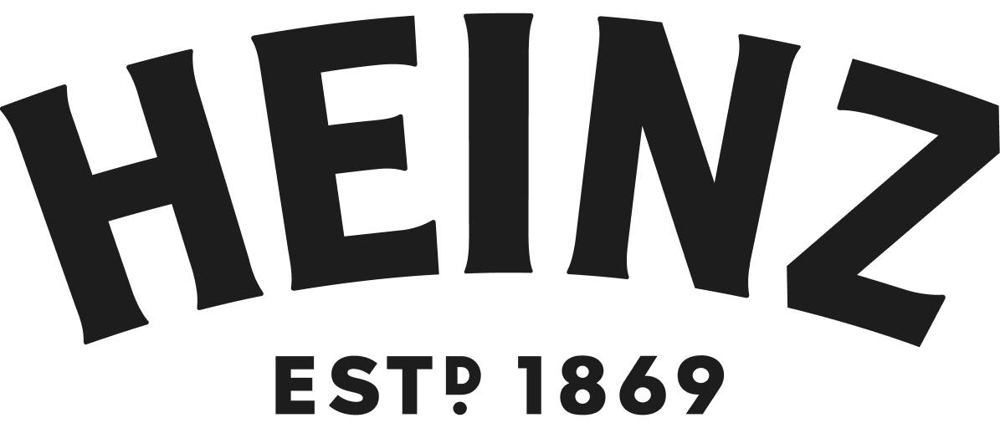

# 🍅 Heinz E-commerce

<p align="center">
  
</p>

<p align="center">
  <strong>🛒 Uma experiência de compra moderna e interativa para produtos Heinz</strong>
</p>

<p align="center">
  
  
  
  
  
</p>

---

## 📋 Sobre o Projeto

Este é um **e-commerce moderno e responsivo** desenvolvido especificamente para a marca **Heinz**, oferecendo uma experiência de compra fluida e interativa para produtos como ketchups, maioneses e mostardas. O projeto combina design moderno com funcionalidades avançadas de um e-commerce completo.

### ✨ Principais Características

- 🎨 **Interface moderna** com animações suaves
- 📱 **Totalmente responsivo** para todos os dispositivos
- 🛍️ **Sistema completo de carrinho** de compras
- 🖼️ **Galeria interativa** de imagens dos produtos
- 🎯 **Seleção de variantes** (tamanho, tipo)
- 📦 **Verificador de entrega** por CEP
- ⭐ **Sistema de avaliações** e reviews
- 🌙 **Suporte a tema escuro/claro**
- 🚀 **Performance otimizada** com Turbopack

---

## 🛠️ Tecnologias Utilizadas

### Frontend Framework

- **⚡ Next.js 15.3.2** - Framework React com renderização server-side e otimizações automáticas
  - _Por que usar?_ Oferece renderização híbrida, otimização automática de imagens, roteamento eficiente e melhor SEO

### UI & Styling

- **🎨 Tailwind CSS 4.1.7** - Framework CSS utility-first para estilização rápida
  - _Por que usar?_ Desenvolvimento mais rápido, bundle menor e design system consistente
- **🎭 shadcn/ui** - Componentes UI modernos e acessíveis
  - _Por que usar?_ Componentes pré-construídos, altamente customizáveis e com boa acessibilidade
- **🌈 Radix UI** - Primitivos headless para componentes complexos
  - _Por que usar?_ Acessibilidade completa, comportamentos complexos já implementados

### Animações & Interações

- **🎬 Framer Motion 12.12.1** - Biblioteca para animações fluidas
  - _Por que usar?_ Animações performáticas, gestos avançados e transições de página suaves
- **✨ Lucide React** - Ícones modernos e consistentes
  - _Por que usar?_ Ícones otimizados em SVG, consistência visual e fácil customização

### Desenvolvimento & Qualidade

- **📘 TypeScript 5.8.3** - Superset do JavaScript com tipagem estática
  - _Por que usar?_ Detecta erros em tempo de desenvolvimento, melhor IntelliSense e código mais robusto
- **🔍 ESLint** - Linter para manter qualidade do código
  - _Por que usar?_ Padronização de código, detecção de problemas e melhores práticas

### Utilitários

- **🔄 clsx & tailwind-merge** - Utilitários para classes CSS condicionais
- **🍞 Sonner** - Sistema de notificações toast elegante
- **🎨 class-variance-authority** - Criação de variantes de componentes type-safe

---

## 🚀 Como Executar

### Pré-requisitos

- **Node.js** 18.17 ou superior
- **pnpm** (recomendado) ou npm/yarn

### Instalação

1. **Clone o repositório**

```bash
git clone <url-do-repositorio>
cd ecommerce
```

2. **Instale as dependências**

```bash
pnpm install
# ou
npm install
```

3. **Execute o servidor de desenvolvimento**

```bash
pnpm dev
# ou
npm run dev
```

4. **Abra no navegador**

```
http://localhost:3000
```

### 📋 Scripts Disponíveis

| Script       | Descrição                                             |
| ------------ | ----------------------------------------------------- |
| `pnpm dev`   | 🚀 Inicia o servidor de desenvolvimento com Turbopack |
| `pnpm build` | 🏗️ Gera build de produção                             |
| `pnpm start` | ▶️ Inicia servidor de produção                        |
| `pnpm lint`  | 🔍 Executa linting do código                          |

---

## 📁 Estrutura do Projeto

```
📦 ecommerce/
├── 📁 app/                          # App Router do Next.js
│   ├── 📄 layout.tsx               # Layout principal
│   ├── 📄 page.tsx                 # Página inicial
│   ├── 📄 globals.css              # Estilos globais
│   └── 📁 produto/                 # Páginas de produto
│       ├── 📄 page.tsx             # Página de detalhes do produto
│       └── 📁 _components/         # Componentes específicos do produto
│           ├── 📁 data/            # Dados mockados dos produtos
│           ├── 📁 hooks/           # Hooks customizados
│           ├── 📁 constants/       # Constantes do projeto
│           └── 📄 types.ts         # Tipagens TypeScript
├── 📁 components/                   # Componentes reutilizáveis
│   └── 📁 ui/                      # Componentes UI (shadcn/ui)
├── 📁 lib/                         # Utilitários e configurações
├── 📁 public/                      # Arquivos estáticos
│   ├── 📁 img/                     # Imagens dos produtos
│   └── 📄 batataG.png             # Imagem da landing page
└── 📄 components.json              # Configuração shadcn/ui
```

---

## 🎯 Funcionalidades Principais

### 🏠 Landing Page

- Animação de texto dinâmica com efeito "fade"
- Transições suaves com Framer Motion
- Design responsivo com foco na experiência do usuário

### 🛍️ Página do Produto

- **Galeria de Imagens**: Visualização interativa com múltiplas imagens
- **Seleção de Variantes**: Escolha de tamanho, tipo e variedade
- **Controle de Quantidade**: Seletor intuitivo respeitando estoque
- **Adicionar ao Carrinho**: Sistema completo de gerenciamento
- **Verificador de Entrega**: Consulta de disponibilidade por CEP
- **Avaliações**: Sistema de ratings e reviews dos produtos

### 🎨 Componentes UI

- Componentes baseados em **Radix UI** para máxima acessibilidade
- Sistema de design consistente com **Tailwind CSS**
- Animações fluidas com **Framer Motion**
- Notificações elegantes com **Sonner**

---

## 🎨 Design System

### 🎨 Paleta de Cores

- **Background**: `#FAF8F4` (bege suave)
- **Secundário**: `#f4f4f4` (cinza claro)
- **Texto**: Baseado em tons de stone
- **Destaque**: Vermelho Heinz para CTAs

### 📐 Responsividade

- **Mobile First**: Design otimizado para dispositivos móveis
- **Breakpoints**: Tailwind CSS padrão (sm, md, lg, xl, 2xl)

---

## 🔧 Configuração Avançada

### shadcn/ui

O projeto utiliza o estilo **"new-york"** do shadcn/ui com:

- **Base Color**: Stone
- **CSS Variables**: Habilitado para temas dinâmicos
- **RSC**: React Server Components ativado
- **Icon Library**: Lucide React

### Tailwind CSS

- **Versão**: 4.1.7 (mais recente)
- **PostCSS**: Configurado para processamento otimizado
- **Animations**: tw-animate-css para animações extras

---

<p align="center">
  <strong>🍅 "Me passa a HEINZ..." 🍅</strong>
</p>
